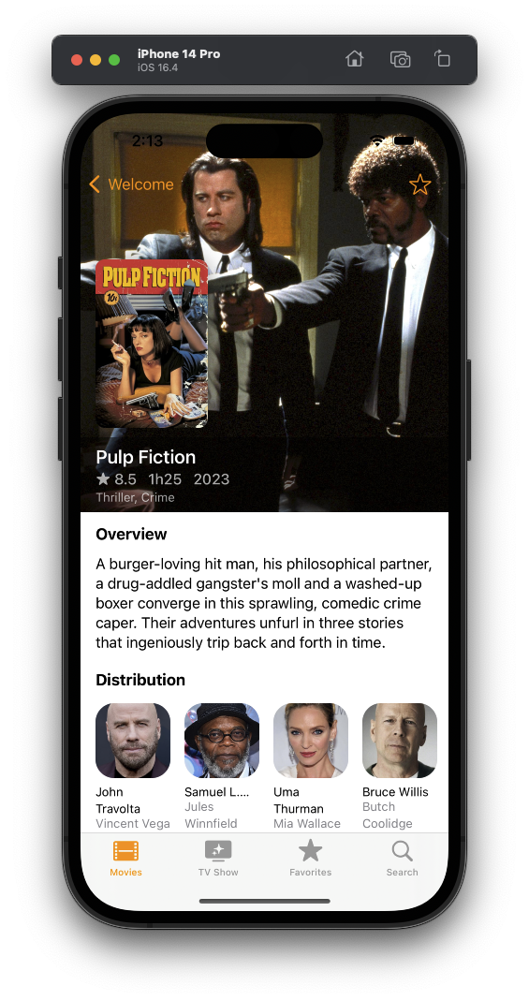
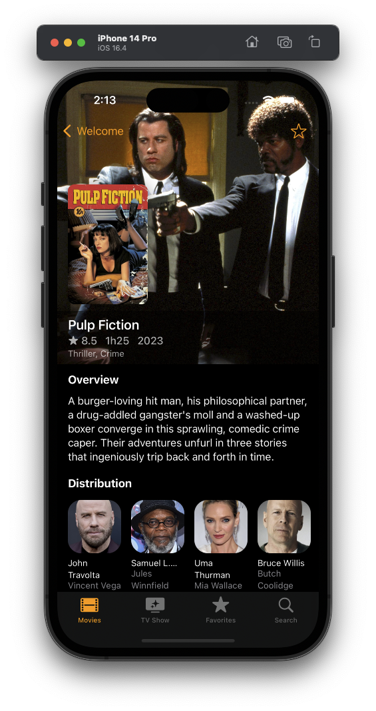

## TheMovieDB
Personal Project - Parsing Movies from TheMovieDB - SwiftUI - Async/Await - Handling Error - MVVM 

- Add JSON file and decode for the prototyping.
- APIService Async/Await with Error Handling.
- Parsing each section of movies with a MovieEndpoint.

## Screenshots

  
  
  
  

